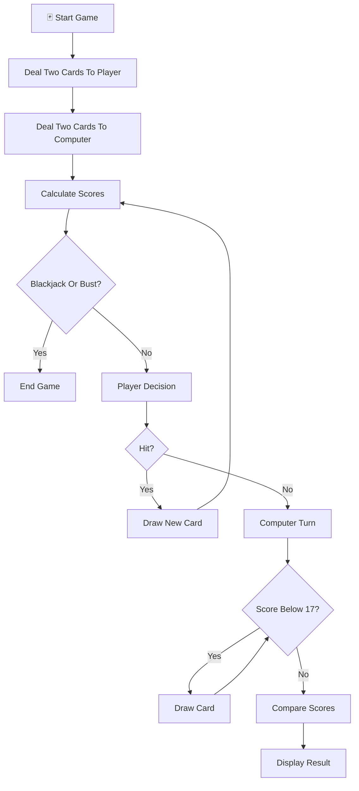
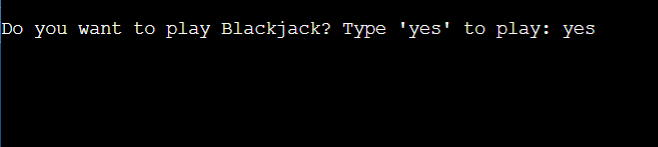
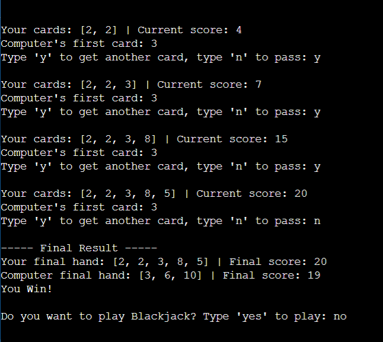

# 🃏 Blackjack Game Simulator (Python)


A fun and interactive **Blackjack card game simulator** built using Python.

This project recreates a simplified version of the classic casino game where the player competes against the computer by drawing cards and trying to reach **21** without going over.

The project demonstrates **game logic, conditional decision making, loops, functions, randomness, and user interaction** through a real-world card game simulation.

---

# 📌 Table of Contents

* 🚀 Features
* 🎴 Game Rules
* 🧠 Gameplay Workflow
* ⚙️ Card System
* 🛠️ Tech Stack
* ▶️ How to Run
* 📸 Example Gameplay
* 🎯 Learning Outcomes
* 🔮 Future Improvements
* 🤝 Contributing
* 📜 License
* 👨‍💻 Author
* ⭐ Support

---

# 🚀 Features

| Feature                 | Description                                               |
| ----------------------- | --------------------------------------------------------- |
| 🃏 Random Card Dealing  | Cards are dealt randomly using Python's random module     |
| 🎮 Interactive Gameplay | Player decides whether to hit or stand                    |
| 🤖 Computer Opponent    | Dealer follows Blackjack rules automatically              |
| ♠️ Ace Handling         | Ace automatically switches between 11 and 1 when required |
| 🏆 Blackjack Detection  | Recognizes natural Blackjack instantly                    |
| 🔄 Replay System        | Allows multiple games without restarting                  |
| ⚡ Real-Time Feedback    | Instant score updates and game results                    |

---

# 🎴 Game Rules

<table>
<thead>
<tr>
<th>🎯 Rule</th>
<th>📌 Description</th>
</tr>
</thead>

<tbody>

<tr>
<td><strong>Goal</strong></td>
<td>Reach 21 or get closer to 21 than the computer</td>
</tr>

<tr>
<td><strong>Number Cards</strong></td>
<td>Cards 2–10 keep their face value</td>
</tr>

<tr>
<td><strong>Face Cards</strong></td>
<td>Jack, Queen, King are worth 10 points</td>
</tr>

<tr>
<td><strong>Ace</strong></td>
<td>Counts as 11 or automatically converts to 1 if necessary</td>
</tr>

<tr>
<td><strong>Blackjack</strong></td>
<td>21 using exactly two cards</td>
</tr>

<tr>
<td><strong>Bust</strong></td>
<td>Any score above 21 results in a loss</td>
</tr>

<tr>
<td><strong>Dealer Rule</strong></td>
<td>Computer continues drawing until reaching at least 17</td>
</tr>

</tbody>
</table>

---

# ⚙️ Card System

The game uses the following virtual deck representation:

| Card   | Value      |
| ------ | ---------- |
| Ace    | 11 (or 1)  |
| 2 - 10 | Face Value |
| Jack   | 10         |
| Queen  | 10         |
| King   | 10         |

Internal card list:

```python
CARDS = [11, 2, 3, 4, 5, 6, 7, 8, 9, 10, 10, 10, 10]
```

---

# 🧠 Gameplay Workflow



---

# 🛠️ Tech Stack

<table>
<thead>
<tr>
<th>⚙️ Technology</th>
<th>💡 Purpose</th>
</tr>
</thead>

<tbody>

<tr>
<td><strong>🐍 Python 3</strong></td>
<td>Main programming language</td>
</tr>

<tr>
<td><strong>🎲 Random Module</strong></td>
<td>Random card generation</td>
</tr>

<tr>
<td><strong>⌨️ CLI Interface</strong></td>
<td>Player interaction</td>
</tr>

<tr>
<td><strong>🔀 Conditional Logic</strong></td>
<td>Game decision making</td>
</tr>

<tr>
<td><strong>🔁 Loops</strong></td>
<td>Continuous gameplay and replay system</td>
</tr>

<tr>
<td><strong>🧩 Functions</strong></td>
<td>Modular and reusable code structure</td>
</tr>

</tbody>
</table>

---

# ▶️ How to Run

<table>
<thead>
<tr>
<th>🚀 Step</th>
<th>💻 Command</th>
<th>📌 Description</th>
</tr>
</thead>

<tbody>

<tr>
<td><strong>1️⃣ Clone Repository</strong></td>
<td><code>git clone https://github.com/your-username/blackjack-game-simulator.git</code></td>
<td>Download project files</td>
</tr>

<tr>
<td><strong>2️⃣ Navigate To Folder</strong></td>
<td><code>cd blackjack-game-simulator</code></td>
<td>Open project directory</td>
</tr>

<tr>
<td><strong>3️⃣ Run Program</strong></td>
<td><code>python Blackjack.py</code></td>
<td>Launch the game</td>
</tr>

</tbody>
</table>

---

# 📸 Example Gameplay

```text
Your cards: [10, 7] | Current score: 17

Computer's first card: 9

Type 'y' to get another card, type 'n' to pass: n

----- Final Result -----

Your final hand: [10, 7] | Final score: 17

Computer final hand: [9, 8] | Final score: 17

It's a Draw.
```

---

# 🖼️ Gameplay Screenshots

### 🎮 Game Session #1



### 🎮 Game Session #2



---

# 🎯 Learning Outcomes

<table>
<thead>
<tr>
<th>📚 Concept</th>
<th>💡 What I Learned</th>
</tr>
</thead>

<tbody>

<tr>
<td><strong>🧩 Functions</strong></td>
<td>Breaking programs into reusable components</td>
</tr>

<tr>
<td><strong>🔀 Conditional Logic</strong></td>
<td>Building game decision systems</td>
</tr>

<tr>
<td><strong>🔁 Loops</strong></td>
<td>Controlling gameplay flow and replay mechanics</td>
</tr>

<tr>
<td><strong>🎲 Randomness</strong></td>
<td>Using random module for unpredictable gameplay</td>
</tr>

<tr>
<td><strong>⌨️ User Input</strong></td>
<td>Handling real-time player decisions</td>
</tr>

<tr>
<td><strong>🧠 Problem Solving</strong></td>
<td>Implementing real-world Blackjack rules through code</td>
</tr>

</tbody>
</table>

💡 *This project strengthened my understanding of game development logic, modular programming, and real-world decision systems.*

---

# 🔮 Future Improvements

* 🃏 Full 52-card deck implementation
* 💰 Betting and virtual chips system
* 👥 Multiplayer mode
* 🖥️ Graphical User Interface (GUI)
* 📈 Statistics tracking
* 🎵 Sound effects and animations
* 🏆 Leaderboard system

---

# 🤝 Contributing

Contributions are always welcome!

Whether you're a beginner exploring Python or an experienced developer looking to improve the game, feel free to contribute.

### Steps to contribute

* Fork this repository
* Create a feature branch
* Make your changes
* Commit your work
* Submit a Pull Request

Let's build and learn together 🚀

---

# 📜 License

<div align="center">

### 🛡️ MIT License

This project is licensed under the MIT License.

</div>

---

### 🔓 What This Means

* ✅ Use the project freely
* ✅ Modify the code
* ✅ Share your own versions
* ✅ Use commercially

Just provide proper attribution.

---

# 👨‍💻 Author

<div align="center">

## Prem Kumar

🎓 Student Developer

💡 Passionate about programming, software development, and building projects that strengthen problem-solving skills.

</div>

---

### 🌟 About Me

* 🎓 B.Tech CSE Student
* 🐍 Learning Python and Software Development
* 🚀 Building projects consistently to improve coding skills

> *"Keep building. Keep learning. Keep going beyond."*

---

# ⭐ Support

<div align="center">

### 💙 Show Your Support

If you found this project helpful or interesting, consider supporting it.

</div>

---

### 🚀 Ways To Support

* ⭐ Star this repository
* 🍴 Fork the project
* 🛠️ Contribute improvements
* 📢 Share it with other learners

---

✨ Every star motivates me to keep building, learning, and sharing more projects with the community.
